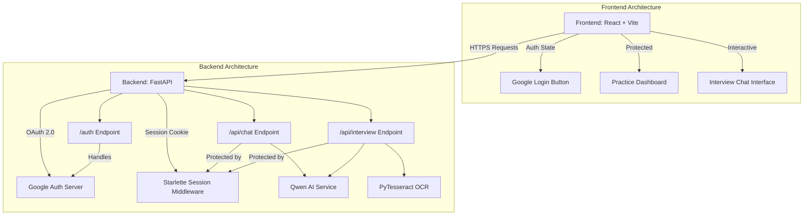

# AI Interview Platform

This is an AI-powered interview platform designed to conduct mock interviews, evaluate responses, and provide a user-friendly dashboard for users to track their progress.

## Capabilities

Currently, the project is capable of:
*   **Google OAuth Authentication:** Users can securely log in using their Google accounts.
*   **Secure Sessions:** Authenticated sessions are managed with secure cookies to protect endpoints.
*   **AI Chat Interface:** An interface for users to chat with the AI (powered by Qwen).
*   **Mock Interviews:** Conduct interactive mock interviews where the AI evaluates responses.
*   **Speech-to-Text:** Frontend support for speech recognition for spoken interview responses.
*   **Document OCR:** Backend support for extracting text from images/documents using PyTesseract.
*   **Dockerized Deployment:** Both frontend and backend are fully containerized and orchestratable using Docker Compose.

## Structure & Architecture

The project consists of a decoupled frontend and backend:

*   **Frontend:** Built with React and Vite. It handles the user interface, including the login page with Google OAuth, the dashboard, and the chat/interview interface.
*   **Backend:** Built with FastAPI. It handles API routing, authentication (via Authlib and Starlette session middleware), business logic, and communication with the Qwen AI model.

### Flowchart Diagram

### Internal Working Architecture

1.  **Authentication Flow:**
    *   The user clicks "Login with Google" on the frontend.
    *   The frontend directs the user to the backend's `/auth/login` endpoint.
    *   The backend initiates the OAuth 2.0 flow with Google.
    *   Google redirects the user back to `/auth/callback` with an authorization code.
    *   The backend exchanges the code for a token, fetches user info, and creates a secure session cookie.
    *   The backend redirects the user to the frontend's `/dashboard`.

2.  **API Requests:**
    *   The frontend makes requests to protected backend endpoints (e.g., `/api/chat`).
    *   Requests include `credentials: "include"` to send the session cookie.
    *   The backend validates the session using `SessionMiddleware`. If unauthorized, it returns a 401.

3.  **AI Integration:**
    *   Valid requests to the chat/interview endpoints are routed to the respective services.
    *   The `QwenService` processes the input and communicates with the underlying AI model.
    *   The backend formats the AI's response and sends it back to the frontend.

4.  **Deployment:**
    *   `docker-compose.yml` spins up a backend container and a frontend container.
    *   A custom bridge network facilitates communication between them.
    *   Volumes can be used for local development to sync code changes without rebuilding the image.
